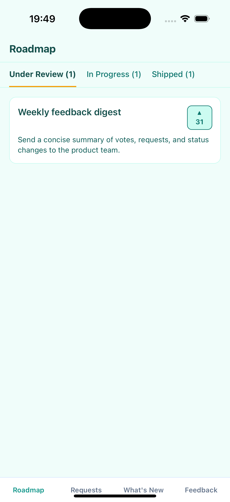
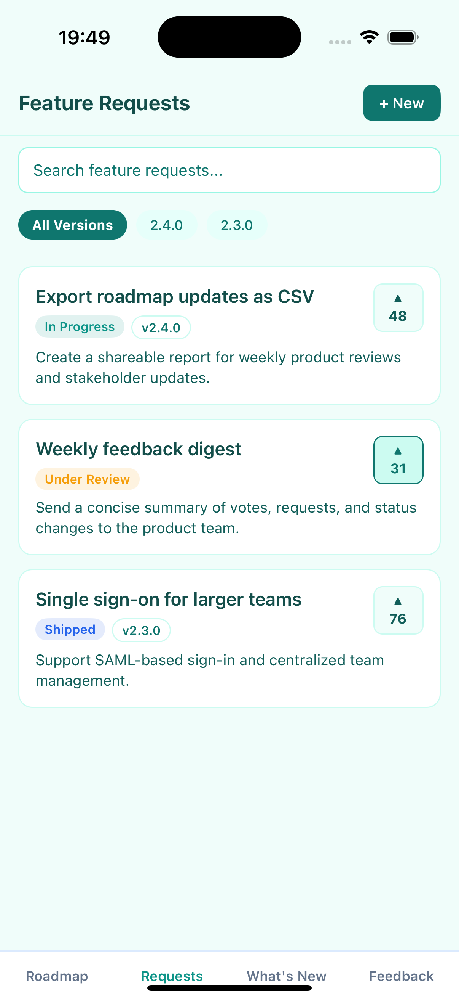
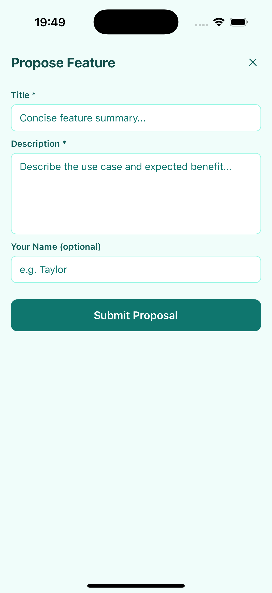
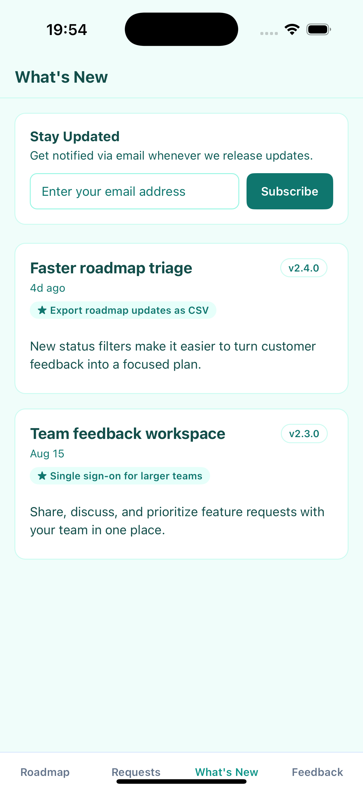
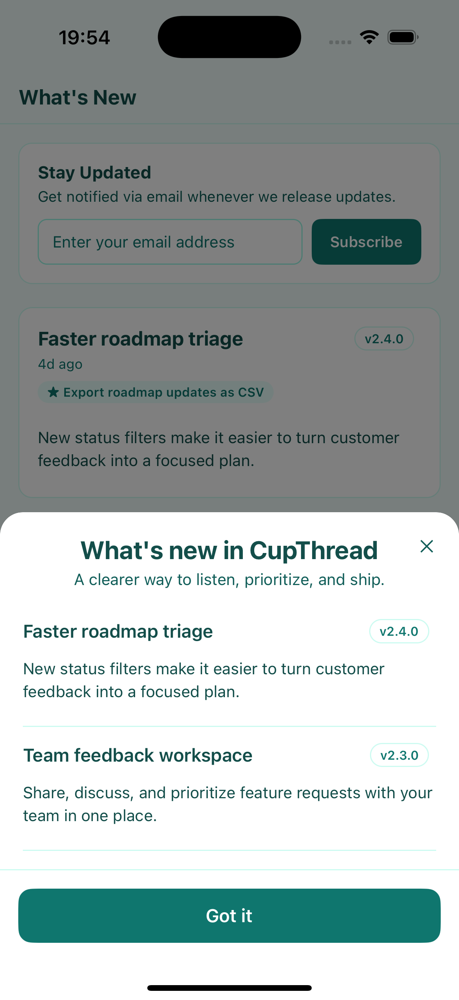
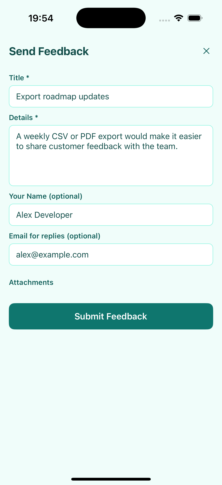

# CupThread React Native & Expo SDK

Official TypeScript SDK for React Native and Expo apps (iOS, Android, and Web).

Part of the [CupThread.com](https://cupthread.com) platform.

## 🤖 Recommended: Install via AI Agent (Agentic Coding)

Instead of manually editing package files and writing boilerplate by hand, install the official **CupThread React Native AI Skill** into your workspace with [`npx skills`](https://github.com/skills-directory/skills) and let your AI assistant (Claude Code, Cursor, Copilot, Windsurf, Codex, Antigravity) integrate and customize it for you:

```sh
npx skills add CupThread/CupThreadAgenticCoding --skill cupthread-react-native-sdk
```

Once installed, simply copy and paste this prompt to your AI coding agent:

```text
Integrate the CupThread SDK (feedback, roadmap, and feature requests screens) into this React Native app. Scaffold a dedicated configuration helper with a placeholder for the App Key, and at the end, remind me with step-by-step instructions on how to set my App Key safely (e.g. via .env or EXPO_PUBLIC_CUPTHREAD_APP_KEY).
```

---

## CupThread Ecosystem
- 🌐 [CupThread.com](https://cupthread.com) — Feedback SaaS platform, developer console, and API.
- 🍏 [CupThread/CupThreadSwiftSDK](https://github.com/CupThread/CupThreadSwiftSDK) — Apple platform SDK (SwiftUI / SPM / XCFramework).
- 🤖 [CupThread/CupThreadAndroidSDK](https://github.com/CupThread/CupThreadAndroidSDK) — Android SDK (Jetpack Compose / Maven).
- ⚛️ [CupThread/CupThreadReactNativeSDK](https://github.com/CupThread/CupThreadReactNativeSDK) — React Native & Expo SDK (TypeScript).
- 💙 [CupThread/CupThreadFlutterSDK](https://github.com/CupThread/CupThreadFlutterSDK) — Flutter SDK (Dart).
- 🧠 [CupThread/CupThreadAgenticCoding](https://github.com/CupThread/CupThreadAgenticCoding) — AI-friendly CLI & Skills for pair programming.

---

## Installation

### Option A: Install from GitHub Release / Tag (Recommended for latest updates)

You can install the SDK directly from the official GitHub repository using a tagged release. It is strongly recommended to pin a specific tag or version commit (e.g. `#v0.1.0`) for repeatable and reproducible production builds:

```sh
# npm
npm install github:CupThread/CupThreadReactNativeSDK#v0.1.0

# yarn
yarn add github:CupThread/CupThreadReactNativeSDK#v0.1.0

# pnpm
pnpm add github:CupThread/CupThreadReactNativeSDK#v0.1.0

# Expo
npx expo install github:CupThread/CupThreadReactNativeSDK#v0.1.0
```

*Note: For package.json dependency specification, use `"@cupthread/react-native": "github:CupThread/CupThreadReactNativeSDK#v0.1.0"`.*

### Option B: Install from npm Registry

```sh
# npm
npm install @cupthread/react-native

# yarn
yarn add @cupthread/react-native

# pnpm
pnpm add @cupthread/react-native

# Expo
npx expo install @cupthread/react-native
```

---

## Quick Start

```tsx
import React from 'react';
import {
  FeedbackClient,
  CupThreadProvider,
  RoadmapBoardScreen,
  FeatureRequestsScreen,
  WhatsNewScreen,
  ChangelogOverlay,
} from '@cupthread/react-native';

const client = new FeedbackClient({
  baseUrl: 'https://api.cupthread.com',
  appKey: 'app_xxx', // from your CupThread Developer Console
});

export default function App() {
  return (
    <CupThreadProvider client={client} locale="zh-Hans">
      <RoadmapBoardScreen />
    </CupThreadProvider>
  );
}
```

---

## Ready-Made React Native Screens & Components

Wrap your app or screen in `<CupThreadProvider client={client}>` to automatically inherit developer console appearance settings, color palette, anonymous user token, and localized strings.

- **`<RoadmapBoardScreen />`**: Kanban roadmap board grouped by public columns with vote counts and stage badges.
- **`<FeatureRequestsScreen />`**: Searchable feature requests list with optimistic upvoting, version filter chips, and propose feature modal.
- **`<FeatureRequestComposeSheet visible={...} onClose={...} />`**: Dedicated modal sheet for proposing new feature requests (`POST /api/v1/feature-requests`).
- **`<WhatsNewScreen />`**: Interactive release notes / changelog with Markdown formatting and email subscription.
- **`<ChangelogOverlay visible={...} onClose={...} />`**: In-app modal announcement sheet for the latest release notes with automatic "seen status" persistence.
- **`<FeedbackComposer visible={...} onClose={...} onPickAttachment={...} />`**: Structured feedback form with attachment upload management.
- **`<UserProfileScreen userId={...} />`**: Public user/developer profile screen.

---

## Visual Showcase

| Roadmap Board | Feature Requests | Submit Request |
| :---: | :---: | :---: |
|  |  |  |
| Kanban columns, stage chips, and votes | Searchable requests with version filters | Focused request composition sheet |

| What's New | Changelog Overlay | Feedback Composer |
| :---: | :---: | :---: |
|  |  |  |
| Markdown release notes and subscriptions | In-app release announcement sheet | Structured, prefilled feedback form |

The images above are produced by a deterministic Expo showcase with fixture data. The same image paths are copied into the generated TypeDoc site, so GitHub Pages and this README always show the identical SDK surfaces.

---

## Key Features & Customization

### 1. Internationalization (i18n)

The SDK includes built-in localization for **English (`en`)** and **Simplified Chinese (`zh-Hans` / `zh-CN`)**. You can configure the locale and provide custom string overrides directly via `<CupThreadProvider>`:

```tsx
<CupThreadProvider
  client={client}
  locale="zh-Hans"
  strings={{
    feedbackComposer: {
      title: '产品反馈与建议',
    },
    featureRequests: {
      newButton: '+ 提点新想法',
    },
  }}
>
  <FeatureRequestsScreen />
</CupThreadProvider>
```

### 2. Changelog Seen Status Persistence

`ChangelogOverlay` and `client.prepareChangelogOverlay()` automatically remember which release notes the user has already seen, avoiding annoying duplicate popups:

```tsx
import React, { useEffect, useState } from 'react';
import { CupThreadProvider, ChangelogOverlay, FeedbackClient } from '@cupthread/react-native';

const client = new FeedbackClient({
  baseUrl: 'https://api.cupthread.com',
  appKey: 'app_xxx',
});

export function AppHomeScreen() {
  const [showOverlay, setShowOverlay] = useState(false);

  useEffect(() => {
    // Only display if the user hasn't seen this latest version release yet
    client.prepareChangelogOverlay({ onlyIfUnseen: true }).then((payload) => {
      if (payload) {
        setShowOverlay(true);
      }
    });
  }, []);

  return (
    <CupThreadProvider client={client}>
      <ChangelogOverlay
        visible={showOverlay}
        onlyIfUnseen={true}
        autoMarkSeen={true} // Marks this version as seen when user closes the modal
        onClose={() => setShowOverlay(false)}
      />
    </CupThreadProvider>
  );
}
```

### 3. Attachment Uploads in Feedback Composer

Connect your preferred file picker (e.g. `expo-image-picker` or `react-native-image-picker`) using the `onPickAttachment` prop. The composer handles file previews, human-readable size badges, removal, and automatic uploading via CupThread Cloudflare R2 / image upload endpoints:

```tsx
import * as ImagePicker from 'expo-image-picker';
import { FeedbackComposer } from '@cupthread/react-native';

<FeedbackComposer
  visible={isOpen}
  onClose={() => setIsOpen(false)}
  onPickAttachment={async () => {
    const result = await ImagePicker.launchImageLibraryAsync({
      mediaTypes: ImagePicker.MediaTypeOptions.Images,
      quality: 0.8,
    });

    if (!result.canceled && result.assets[0]) {
      const asset = result.assets[0];
      return {
        kind: 'image',
        filename: asset.fileName || 'screenshot.png',
        mimeType: asset.mimeType || 'image/png',
        fileUri: asset.uri,
      };
    }
    return null;
  }}
/>
```

### 4. Persistent Anonymous User Token

The SDK generates a persistent client token (`cupthread_user_token_v1`) to attribute upvotes and feedback across app restarts. Compatible with synchronous storage or asynchronous adapters like `@react-native-async-storage/async-storage`:

```tsx
import AsyncStorage from '@react-native-async-storage/async-storage';
import { UserTokenStore } from '@cupthread/react-native';

UserTokenStore.configure(AsyncStorage);
```

---

## API Client Surface

| Method | Endpoint | Description |
| ------ | -------- | ----------- |
| `submit(draft, userToken?)` | `POST /api/v1/feedback` | Submit feedback draft with metadata and attachments |
| `uploadAttachment(options)` | `POST /api/v1/uploads/{images,r2}` | Upload screenshot or log attachment |
| `fetchAppConfig()` | `GET /api/v1/public/config/{appKey}` | Fetch app branding, appearance, and public settings |
| `fetchColumns()` | `GET /api/v1/public/columns/{appKey}` | Fetch Kanban board columns for roadmap |
| `fetchVersions()` | `GET /api/v1/public/versions/{appKey}` | Fetch release versions |
| `fetchFeatureRequests(options)` | `GET /api/v1/feature-requests` | List and search public feature requests |
| `submitFeatureRequest(draft, userToken)` | `POST /api/v1/feature-requests` | Propose a new feature request proposal |
| `toggleVote(featureRequestId, userToken)` | `POST /api/v1/feature-requests/{id}/vote` | Upvote or remove upvote |
| `fetchComments(featureRequestId)` | `GET /api/v1/feature-requests/{id}/comments` | Fetch discussion comments |
| `postComment(featureRequestId, draft, userToken)` | `POST /api/v1/feature-requests/{id}/comments` | Post a comment or reply |
| `fetchChangelog()` | `GET /api/v1/public/apps/{appKey}/changelog` | Fetch published release notes |
| `prepareChangelogOverlay(options?)` | `GET /api/v1/public/config & changelog` | Prepares changelog overlay with `onlyIfUnseen` filter |
| `subscribeToChangelog(email, userToken)` | `POST /api/v1/public/apps/{appKey}/changelog/subscribe` | Subscribe email to changelog |
| `unsubscribeFromChangelog(email)` | `POST /api/v1/public/apps/{appKey}/changelog/unsubscribe` | Unsubscribe email from changelog |
| `updateUserAttributes(options)` | `PUT /api/v1/public/apps/{appKey}/user` | Report user attributes (paying, plan, MRR) |
| `fetchUserProfile(userId)` | `GET /api/v1/users/{userId}/profile` | Fetch public user profile |

---

## Development & Publishing

```sh
# Typecheck TypeScript source
npm run typecheck

# Run automated tests
npm test

# Clean compile ESM, CommonJS, and TypeScript declarations into dist/
npm run build

# Build the Expo showcase and recapture the six checked-in documentation images
# Requires Xcode Simulator and AXe (`brew install steipete/tap/axe`)
npm run screenshots

# Generate the TypeDoc site and copy the checked-in showcase images into it
npm run docs

# Automated release (validates tests, bumps version, builds dist, tags git release)
node scripts/release.mjs --version 0.1.1 [--dry-run]
```

## License
MIT
